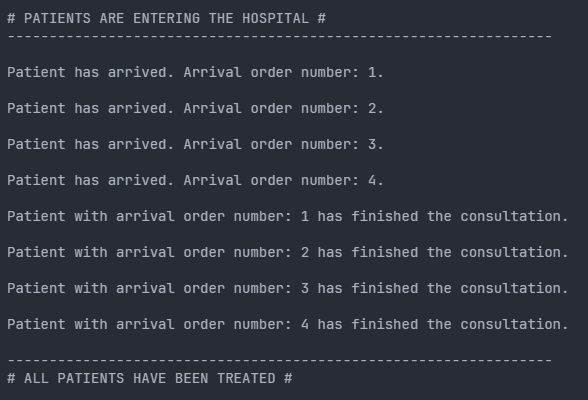

# EJERCICIO 1 - TAREA 1

 

### Descripción

Para esta tarea, se buscan los siguientes objetivos:

- Simular llegada al hospital de 4 pacientes.
- Deben ser atendidos en cualquiera de las 4 consultas disponibles.
- Llegan cada 2 segundos.
- Hay 4 médicos y se asignarán de forma aleatoria.
- Los médicos solo pueden atender a un paciente al mismo tiempo.
- El tiempo de atención es de 10 segundos.
- Cada vez que llega un paciente se mostrará por pantalla un mensaje con su número de llegada.
- Cada vez que entre en consulta también mostrará un mensaje por pantalla.

 

### Pregunta 1

`¿Cuántos hilos se están ejecutando en este programa? Explica tu respuesta`

> **Respuesta según el código**:
> 
> Se están ejecutando 5 hilos diferentes. Dado que tenemos el hilo principal de la aplicación, y otros cuatro que se generan mediante un "for", obetenemos un total de 5 hilos en ejecución.

 

### Pregunta 2

`¿Cuál de los pacientes entra primero en consulta? Explica tu respuesta`

> **Respuesta según el código**:
> 
> El primer paciente que entra en consulta es el Paciente 1. Si partimos de la base que genera el enunciado, cada llegada de paciente es separada por un lapso de tiempo de 2 segundos. En mi caso, siempre entrará primero el Paciente 1. Si, en lugar de mi código actual, hubiese creado una lista de 4 hilos y hubiese decidido que la ejecución de los mismos se hiciese de forma random, sacando aleatoriamente hilos de la lista, el orden de entrada podría ser diferente en cada ejecución.
> 
> Pero si leemos detenidamente el enunciado, dice: << Llega un paciente cada 2 segundos >>. En mi opinión, en esa sentencia, se confirma que la creación es en con ese intervalo, por lo tanto, siempre se ejecutará el mismo hilo en primer lugar.
> 
> En el segundo caso que he expuesto estaríamos dando por hecho que ya existen esos 4 pacientes (la lista de hilos pre-creada), y creo que no es el objetivo de esta tarea. Para que en este caso fuese totalmente válido en relación al enunciado, debería decir algo como: << En una sala de espera, donde hay 4 pacientes esperando, se les llama para entrar en consulta cada 2 segundos >>.

> [!NOTE]
> 

>  
Sammy del futuro: haz clic para ver

>  
> Conforme se va acercando el final de la práctica, te das cuenta de que este método no es lo más óptimo para crear los pacientes y tratarlos. Un hilo por cada paciente no es adecuado, mejor usar el método Productor/Consumidor.
> 

 

### Pregunta 3

`¿Cuál de los pacientes sale primero de consulta? Explica tu respuesta`

> **Respuesta según el código**:
> 
> En el caso de la salida, creo que es indiferente el método que usemos, si el de la creación por intervalo o el de una lista de hilos. Tanto para uno como para otro, se pide un intervalo de 2 segundos para la ejecución y 10 segundos de “consulta”, por lo tanto, siempre saldrá en primer lugar el mismo paciente que entró en primer lugar. Si no tuviésemos un intervalo de ejecución ni para entrar ni para salir, podría salir en primer lugar cualquiera de los 4 pacientes.

 

### Prueba

