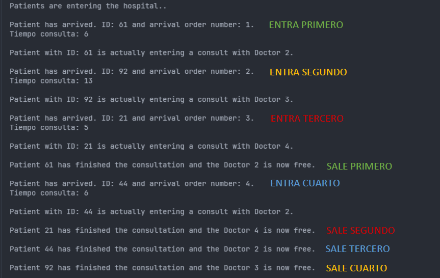

# EJERCICIO 1 - TAREA 2

 

### Descripción

Para esta tarea, se buscan los siguientes objetivos:

#### Para los pacientes:
- Un identificador único, un número entero aleatorio del 1 al 100.
- Un tiempo de llegada al hospital (en segundos, empezando en 0 cuando llega).
- El tiempo en consulta con un médico (un numero aleatorio entre 5 y 15 segundos).
- El estado:
  - Espera: ha llegado al hospital pero aún no ha entrado en consulta.
  - Consulta: ha entrado en consulta.
  - Finalizado: ha finalizado la consulta.

#### Para el programa:
- Los pacientes estarán en consulta el tiempo indicado en TiempoConsulta.
- Mostrar por pantalla el ID del paciente y el número de llegada.

 

### Prueba

 

> [!WARNING]
> La consola de la imagen no va a coincidir con el resultado final del proyecto. Esta forma de visualizar los datos se ha establecido para mostrar toda la información posible para entender el flujo del programa, así como para desarrollar su explicación.
> 
> Para el resultado final del proyecto, se usará el estilo explícitamente solicitado en el enunciado.

 

### Pregunta 1

`¿Cuál de los pacientes sale primero de consulta? Explica tu respuesta.`

> **Respuesta según el código**:
> 
> Realmente depende un poco de la relación que hay, entre el tiempo que tarda el paciente en consulta, con el tiempo transcurrido de los pacientes que entraron antes que él (si fuese el caso).
> Como ya traemos de la anterior tarea, se pide un intervalo de 2 segundos entre entrada de pacientes:
> 
> - Paciente 1 entra *(tiempo consulta 10s asignado de forma aleatoria)*
>   
> 
 
>
> ###### Pasan 2 segundos (a Paciente 1 le quedan **8s** de consulta) <-
>
> 

> 
> - Paciente 2 entra *(tiempo consulta 15s asignado de forma aleatoria)* **[Obviamos este paciente]**
>
> 
 
>
> ###### Pasan 2 segundos (a Paciente 1 le quedan **6s** de consulta)
>
> 

>
> - Paciente 3 entra *(tiempo consulta 7s asignado de forma aleatoria)* <-
> 
> Como vemos, Paciente 3 tiene asignado el menor tiempo de consulta, sin embargo, el primero en salir de consulta debería ser Paciente 1. Todo depende de la relación mencionada anteriormente.
> 
> Si nos fijamos en la captura, vemos como el paciente con ID: 61 tiene asignado un tiempo de consulta de 6s. Posteriormente, el tercer paciente (ID: 21) que tenía asignado 5s de consulta, sale más tarde que el primero, a pesar de tener menor tiempo de consulta.
>
> De la misma forma, podemos ver como el segundo paciente, con ID: 92, es el último en salir de la consulta, ya que, teniendo en cuenta la relación hora llegada/tiempo consulta, acaban con una diferencia de 3 segundos (Cuando el paciente 4 con ID: 44 salió de consulta, al segundo paciente aún le quedaban 3
> segundos para salir).
>
> También podemos observar como el primer paciente, al salir antes que la entrada del cuarto, deja libre al Doctor 2, dando la posibilidad de que el último que entre pueda acceder a él. De hecho Doctor 1 ni siquiera es asignado en todo el programa (Así también trabajo yo.. jaja).
