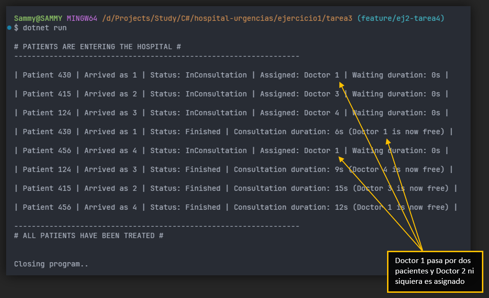

<div align="center">

# EJERCICIO 1 - TAREA 3

</div>

<br>

### Descripción

Para esta tarea, se buscan los siguientes objetivos:

- Mostrar por consola la información del paciente:
  - Cambios de estado.
  - Orden de llegada.
  - Tiempo entre cambios de estado.
- En cada cambio de estado debe visualizarse el cambio.

<br>

```
Ejemplo de visualización:

Paciente 12. Llegado el 1. Estado: Finalizado. Duración Consulta: 10 segundos.
Paciente 34. Llegado el 2. Estado: Consulta. Duración Espera: 0 segundos.
Paciente 53. Llegado el 3. Estado: Consulta. Duración Espera: 0 segundos.
Paciente 12. Llegado el 1. Estado: Consulta. Duración Espera: 0 segundos.
```

<br>

<div align="center">

### Prueba


</div>

<br>

### Pregunta 1

`¿Has decidido visualizar información adicional a la planteada en el ejercicio? ¿Por qué? Plantea qué otra información podría ser útil visualizar.`

> **Respuesta según el código**:
> 
> He decidido usar dos campos más para visualizar de forma adicional, ambas están relacionadas con el Doctor asignado a cada paciente.
> 
> Para el estado de Consulta se muestra el Doctor asignado, y para el estado de Finalizado mostramos el Doctor que queda liberado. De esta forma, en el caso de que un Doctor se libere rápido, podríamos visualizar si ha sido reasignado, tal y como vemos aquí y en la tarea anterior.
