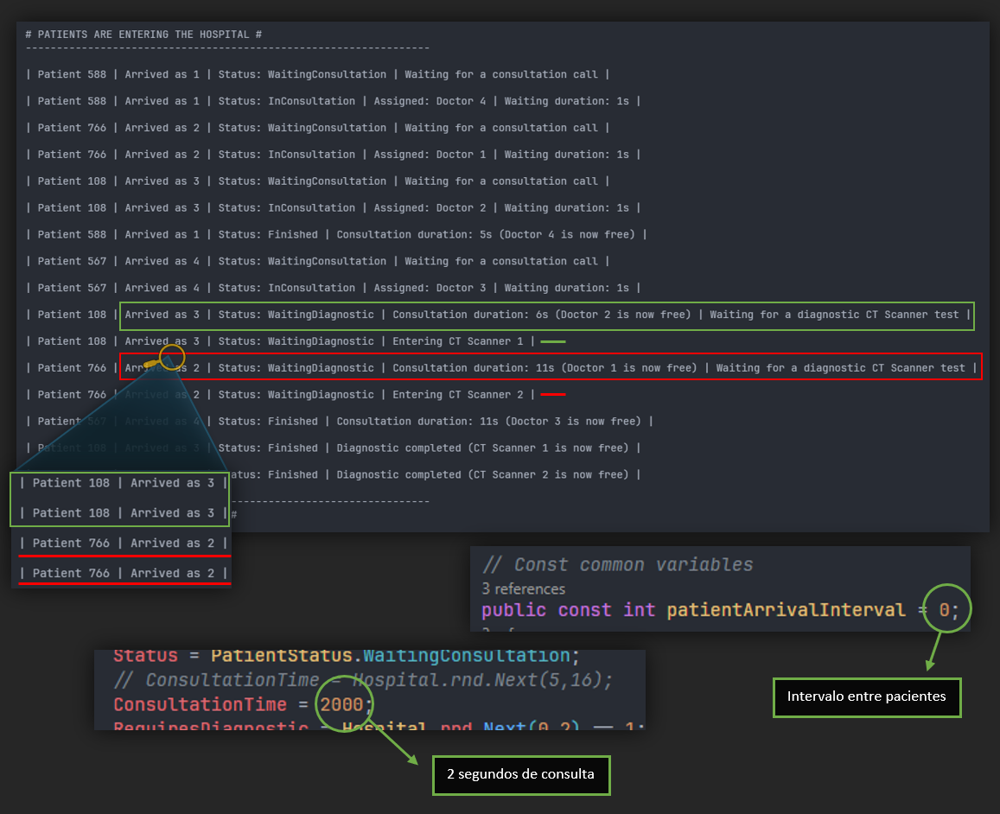

# EJERCICIO 2 - TAREA 1

 

### Descripción

Para esta tarea, se buscan los siguientes objetivos:

- El hospital debe poseer 2 máquinas scanner de diagnóstico.
- Cada máquina solo pueden ser usada por un paciente al mismo tiempo.
- Ampliar la clase Paciente con el atributo RequiereDiagnostio (booleano). Se tiene que generar aleatoriamente.
- Los pacientes entran primero en consulta y a continuación se hacen las pruebas si es necesario.
- Simular pruebas de diagnóstico con un tiempo adicional (15 segundos).
- Ampliar la clase Estado permitiendo los siguientes estados:
  - EsperaConsulta: ha llegado al hospital pero aún no ha entrado en consulta.
  - Consulta: está en consulta y aún no ha salido.
  - EsperaDiagnostico: requiere diagnóstico, pero aún no ha sido expuesto al scanner.
  - Finalizado: ha finalizado la consulta y el diagnóstico si es que era necesario.
- Actualizar visualización del avance.

 

> [!CAUTION]
> En este Ejercicio 2, concretamente a partir de la Tarea 2 (inclusive) empiezo a usar el código modularizado que se comparte para el resto de tareas. En consecuencia a esto, es posible que el contenido de algunas capturas no concuerde con el flujo evolutivo de las tareas (puede ser que se vea alguna línea de
> código añadida que no tenga relación con la Tarea), ya que este documento, ha sido rellenado a posteriori. Aun así, para cada tarea nos quedaremos con lo esencial del código relacionado a la misma. Espero que no suponga ningún inconveniente, el objetivo ha sido en todo momento aplicar DRY en lo máximo posible 
> bajo mis capacidades y las intenciones son todas positivas.

 

### Prueba

 

### Pregunta 1

`¿Los pacientes que deben esperar para hacerse las pruebas diagnostico entran luego a hacerse las pruebas por orden de llegada? Explica que tipo de pruebas has realizado para comprobar este comportamiento. `

> **Respuesta según el código**:
> 
> No, los pacientes no se esperan por orden de llegada. Si un paciente con orden de llegada 2 acaba antes su consulta que el paciente con orden de llegada 1, el segundo en llegar entrará primero a hacerse las pruebas para el diagnóstico (no es ideal).
> 
> Las pruebas que he realizado han sido:
> - Ejecuté el programa en varias ocasiones en busca del “error” (menos eficiente).
> - Modifiqué el método HospitalProgram() de la clase Hospital. Quité el intervalo entre llegada de pacientes para que llegaran todos CASI al mismo tiempo. También modifiqué los segundos de la consulta para que todos saliesen al mismo tiempo. (más eficiente y rápida).
>   
> (Podría haber convertido el for normal que tengo implementado por un parallelfor para la creación de los hilos, pero con la segunda prueba fue más que suficiente y me ahorré algo de tiempo).
