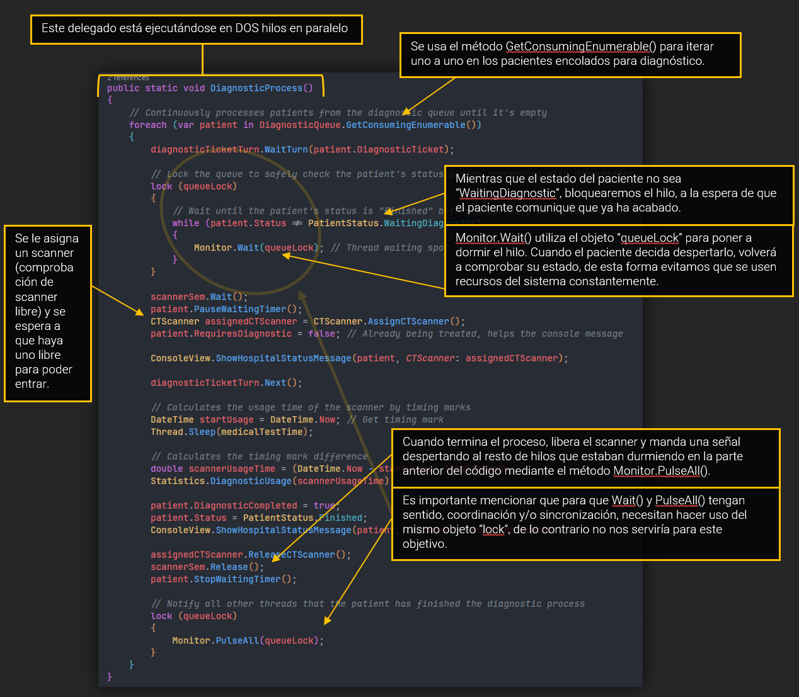
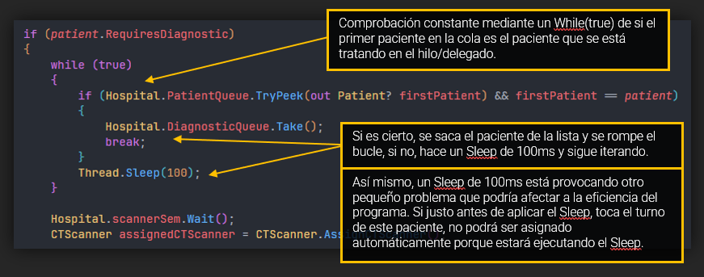

# EJERCICIO 2 - TAREA 2

 

### Descripción

Para esta tarea, se buscan los siguientes objetivos:

- Ahora los pacientes deberán pasar a diagnóstico por orden de llegada al hospital.

 

### Prueba

 

### Pregunta 1

`Explica la solución planteada en tu código y porqué las has escogido.`

> **Respuesta según el código**:
> 
> Después dar vueltas por el temario, por las videoconferencias y los ejercicios, no encontré ninguna otra forma de hacer esta terea funcionar de forma óptima y eficiente. Así que después de estar picando y probando, conseguí el objetivo, pero no era lo más óptimo, no me convencía para nada.. y es este método
> el que me guardo para Parte 2 (otra posibilidad de solución). Es una solución, pero me reitero, no es lo más óptimo.
> 
> Es aquí cuando decido tirar de Google y de la Docu para encontrarme con la octava maravilla del mundo. Monitor. Gracias a este objeto y algunos sus métodos (Wait/PulseAll) podemos sincronizar los hilos mediante un objeto “lock”, dejando en espera y liberando hilos en cualquier parte del flujo que consideremos
> oportuno. A todo esto también le sumamos las colas concurrentes y blockingcollections.
> 
> Después de todo esto, aquí es donde me respondiste a un correo con un par de pistas, una de ellas Monitor (que ya había descubierto antes). Gracias a tu respuesta, pude sumarle a Monitor la sugerencia del GetConsumingEnumerable(). Este es un método que nos proporciona las BlockingCollections el cual permite
> sacar elementos de la cola al estilo “productor/consumidor”. Este método ya trae consigo mismo:
> - Cuando tiene elementos, los saca en orden uno a uno.
> - Si aún no hay elemento en la lista se queda esperándolo (bloqueado, no gasta recursos comprobando).
> - Si llega un nuevo elemento lo procesa.
> - Repite hasta que le indicamos que pare con el método CompleteAdding().
>
> [En la segunda respuesta del foro, con el ejemplo del jefe y el trabajador lo explican suuuper bien.](https://stackoverflow.com/questions/1559293/c-sharp-monitor-wait-pulse-pulseall)

 

> [!CAUTION]
> 

>  
SPOILER: haz clic para ver

>  
> Para esta Tarea, después de realizar la siguiente (Tarea 3) decidí implementarle también el sistema de Tickets, permitiendo forzar aún más el orden de llegada al Hospital. Realmente no hace falta este método porque con el Scanner.Wait() es más que suficiente, pero aun así, cuando leas la explicación > de la Tarea que sigue, entenderás por qué decidí implementarla.
> 

 

### Pregunta 2

`Plantea otra posibilidad de solución a la que has programado.`

> **Respuesta según el código**:
> 
> La otra forma de resolver esta tarea, y menos óptima, es el uso de comprobaciones sin parar, permitiendo al programa hacer uso constante de los recursos del sistema.
> 
> Tampoco se está incluyendo la asignación del scanner dentro de un lock, lo que puede provocar el siguiente comportamiento:
>
> - Paciente 1 entra a consulta (Tiempo de consulta **12s** asignado de forma aleatoria)
>   
> - Paciente 2 entra a consulta (Tiempo de consulta **6s** asignado de forma aleatoria)
>   
> - Paciente 2 sale de consulta y ***espera diagnóstico*** (se espera a que Paciente 1 salga, lo cual está bien)
>   
> - Paciente 1 sale de consulta y ***espera diagnóstico*** 
>   
> 
 
>
> ###### (Ambos scanners están libres y se asignan de forma aleatoria, scanner 1 o 2)
>
> 

>
> - Paciente 2 entra en CT Scanner 2
>
> - Paciente 1 entra en CT Scanner 1
>
> El comportamiento adecuado sería que, aunque hubiera 2 scanners libres, se respete por completo el orden de prioridad por orden de llegada al hospital. Lo esperado sería que, aunque Paciente 2 salga antes y espere su turno, también espere a que Paciente 1 entre primero a cualquier scanner.
>
> Esto de nuevo, se soluciona en la primera y definitiva solución de la tarea.

 

### Prueba

