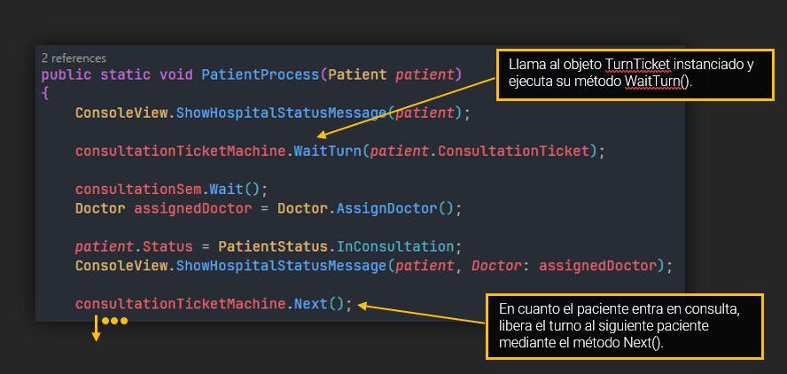

# EJERCICIO 2 - TAREA 3

 

### Descripción

Para esta tarea, se buscan los siguientes objetivos:

- Se mantendrán 4 consultas médicas.
- Se mantendrán los 4 médicos.
- Se mantendrán las 2 máquinas de diagnóstico.
- Añadiremos ahora un total de 20 pacientes.
- Tendrán que esperar si no hay una consulta médica disponible.

 

### Pregunta 1

`Explica el planteamiento de tu código y plantea otra posibilidad de solución a la que has programado y porqué has escogido la tuya.`

> **Respuesta según el código**:
> 
> Para esta tarea, una posibilidad de código era el uso de los propios semáforos. Mediante el método Wait(), el cual permite dejar en espera a los hilos que quieren acceder. Este mismo método, al igual que los deja en espera, los va metiendo en ORDEN según se van liberando huecos, PERO, en la documentación
> oficial de .NET, NO nos aseguran que este comportamiento vaya a ser así de forma permanente en todos los casos posibles.
> 
> Así que, a pesar de que esta segunda opción pueda ser viable, no vamos a ser chapuceros y vamos a elegir la buena. ¡EL FAMOSO SISTEMA DE TICKETLOCK! Lo suelto como si lo conociera de toda la vida pero llevo unas horas con ese conocimiento jaja.
> 
> Maravilloso, además de simple y efectivo, es super gráfico. Refleja super bien una cola real, ya sea en el super o en la pescadería, y por supuesto, para nuestro sistema de turnos para los pacientes nos va de cine (También ha sido aplicado para los diagnósticos y así mantener un orden de entrada).
> 
> Si rescatamos la parte inicial del código podremos ver la implementación de este sistema en dos simples líneas:

 

### Prueba

 

 

### Pregunta 2

`¿Los pacientes que deben esperar entran luego a la consulta por orden de llegada? Explica que tipo de pruebas has realizado para comprobar este comportamiento. `

> **Respuesta según el código**:
> 
> Gracias al sistema expuesto anteriormente, sí, los pacientes entran a consulta en su orden de llegada. El sistema de TicketLock es un sistema bastante sólido, dando un resultado fiable de una forma muy sencilla.
> 
> Para realizar las pruebas, he probado el programa de forma normal en varias ocasiones para comprobar qué tal se portaba. Después de ver que se comportaba de la forma esperada, decidí darle algo más de chicha modificando su variables y comentando el intervalo entre pacientes. El resultado sigue siendo bueno.

 

  
### Prueba

