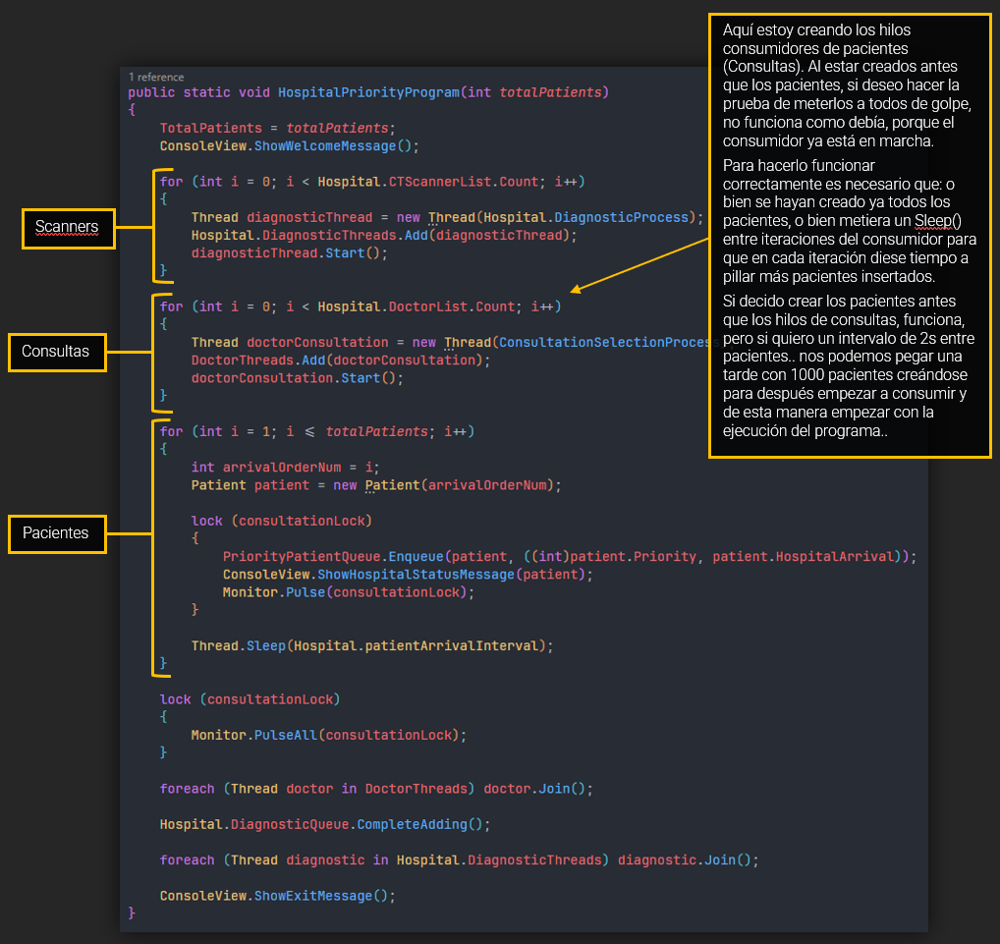
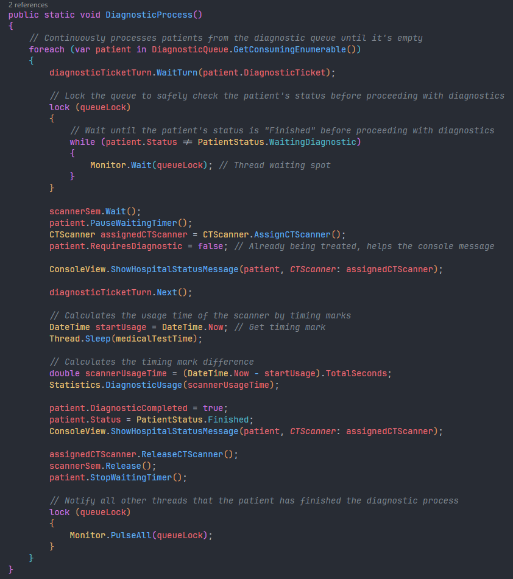

# EJERCICIO 2 - TAREA 4

 

### Descripción

Para esta tarea, se buscan los siguientes objetivos:

- Ahora, al llegar al hospital se asignará un nivel de prioridad:
  - Emergencias (nivel 1): Atendidos primero.
  - Urgencias (nivel 2): Atendidos después de las emergencias.
  - Consultas generales (nivel 3): Atendidos al final.
- Ampliar la clase Paciente con el atributo prioridad (int).
- Entraran por orden de prioridad, si hay empate en prioridad será por orden de llegada.

 

> [!NOTE]
> He preferido crear un ENUM para las prioridades, creo que era más descriptivo y más legible de cara a la mantenibilidad del código.

 

### Pregunta 1

`Explica el planteamiento de tu código y plantea otra posibilidad de solución a la que has programado y porqué has escogido la tuya.`

> **Respuesta según el código**:
> 
> ¡Mamma mía!
> 
> Esta tarea me ha vuelto loco, ha hecho que me replanteara el código entero. Después de haber implementado el sistema de tickets (que de hecho me ha encantado), se me ha sido imposible aplicarlo para esta tarea. Intenté creando 3 “Tickets Lock” diferentes para cada lista de niveles (Emergencia, Urgencia y
> General) pero.. vaya caos.
> 
> Al final, después de dar 5748 vueltas y pegarme 2 tardes enteras sin hacer funcionar el código correctamente, me puse a indagar en la docu y vi que existe un método llamado PriorityQueue<TElement,TPriority>   …  ¿En serio? jeje
> 
> Nada que decir, es perfecta para la ocasión. TElement = Prioridad del paciente y TPriority = orden de llegada, simple.
> 
> Lo único es que esta lista ha provocado que re-implementara casi todo el código del programa. Antes creaba hilos según el número de pacientes, pero ahora me doy cuenta de que ha sido un error.. Debería haber ido creando pacientes, ir metiéndolos en una lista, y después mediante el método
> Productor/Consumidor, ir sacando esos pacientes. Es decir, 2 hilos para los Scanners y 4 hilos para las consultas.. que tonto.. bueno, me sirve de aprendizaje, que es el objetivo.
>
> Sólo he encontrado un pequeño problema en esta implementación (la cual me parece la más correcta desde luego), y es que si echas un ojo al código:

 

### Prueba del problema

 

> [!WARNING]
> Aquí el código está un poco atrasado, al final del programa está un poco más evolucionado, pero todo lo que aparace en la imagen sigue igual en la implementación final y el problema que planteo se mantiene exactamente igual.

 

> Aunque siguiendo el enunciado << Intervalo de 2 segundos entre llegada de paciente >>, esta solución es más que funcional.
> 
> Para esta solución (y ya habiendo visto la captura anterior), así es como he implementado la selección de las prioridades:

 

### Prueba

 

> Una vez tenemos la selección, se procede con el flujo del método PriorityPatientProcess, que en esencia, es exactamente lo mismo que hemos estado viendo en el resto de tareas. Lo único que no comparte son las líneas del “Ticket Lock”.
> 
> De hecho, para los diagnósticos, aunque no se mencione explícitamente, he decidido que entren a diagnostico mediante el mismo nivel de prioridad. Reaprovechamos ese código y usamos el mismo sistema de “Ticket Lock” pero para esos diagnósticos.
> 
> La única diferencia está en la posición del bloque donde se asigna el ticket. Si lo hubiese dejado dentro de PriorityPatientProcess, seguiría ocurriendo de forma parecida al anterior método, entrarían a diagnóstico por orden de entrada a consulta.
> 
> Tiene más sentido que diagnostiquen al paciente con mayor nivel de prioridad (por tandas). ¡NO SE NOS MUERA POR DIOS!
>
> Dejo constancia de ambos métodos:

 

### Pruebas

 

 
 

> Creo que son métodos que tienen una estructura muy fácil de leer y de mantener.
> 
> Por supuesto todo es mejorable, pero a mi se me ha hecho muy cómodo realizar los pasos teniendo todo encapsulado con anterioridad.
>
> Ha sido todo un desafío (como bien decías en la videoconferencia).
> 
> Modularizar los métodos lo máximo posible para poder reutilizarlo entre las diferentes Tareas (algunas al menos), ha sido un rompecabezas brutal.
> 
> Entiendo que todo debe ir programa a programa para ver una evolución, pero, desde que comencé los estudios, se nos ha machacado el concepto de DRY (Dont Repeat Yourself), y se me hace muuuuy complicado programar sin encapsular y modularizar.
> 
> > 
 
>
> ###### (Seguramente me esté dejando muchas mejoras aplicables)
>
> 

>
> La otra posibilidad de código que se me ocurre es creando 3 colas y una máquina de tickets para cada una de ellas. Una para cada nivel de prioridad e ir insertando en ellas a los pacientes correspondientes. Añadiría más código al lienzo y yo creo que con la PriorityQueue.. ya tenemos más que camino hecho.
> << No reinventemos la rueda señores >>  me decía mi abuelo.

 

### Prueba

