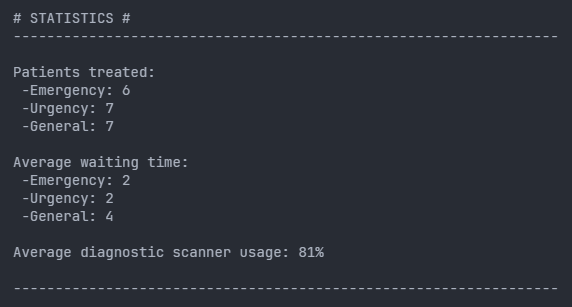
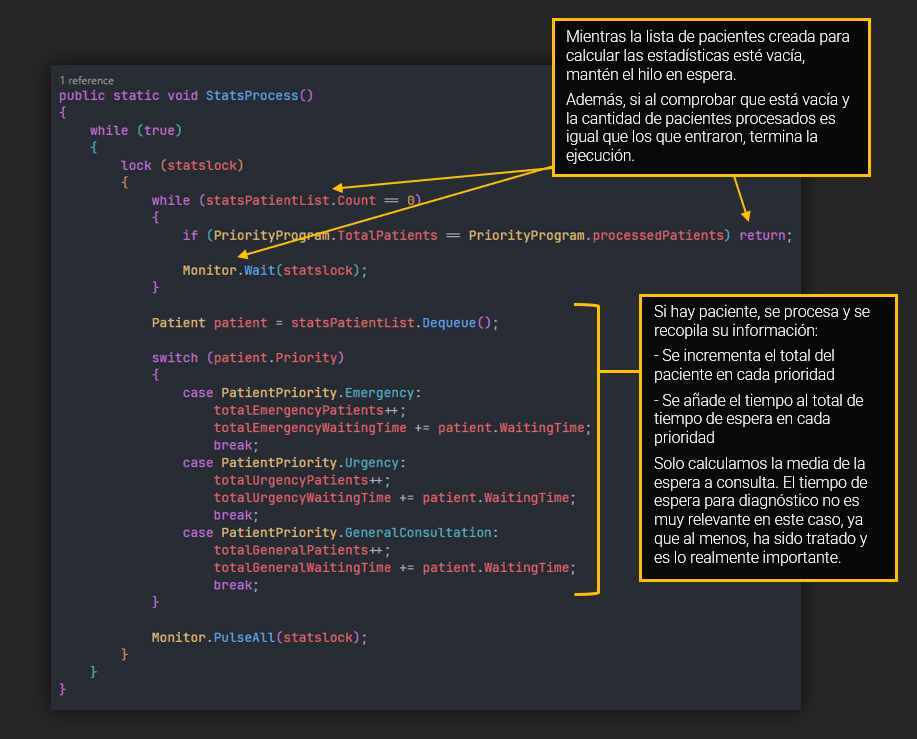
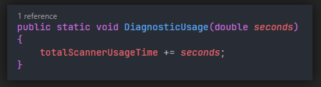
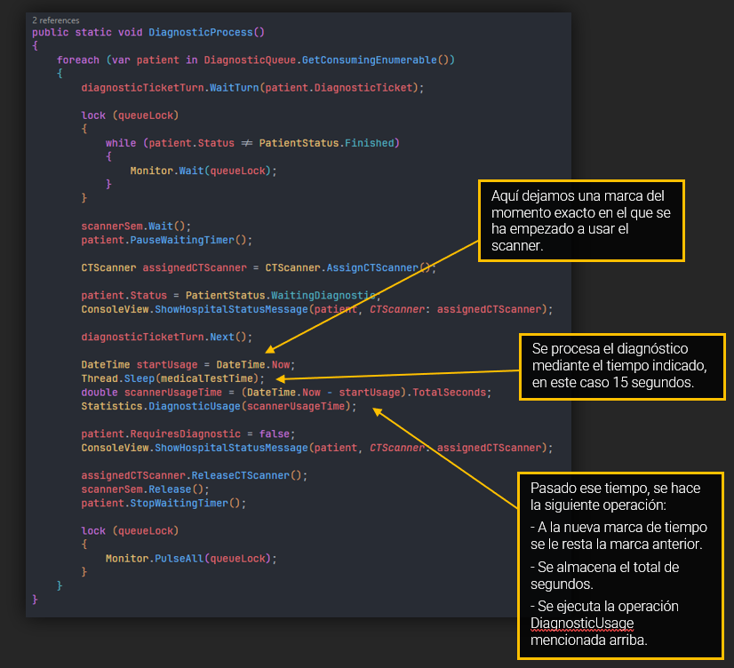
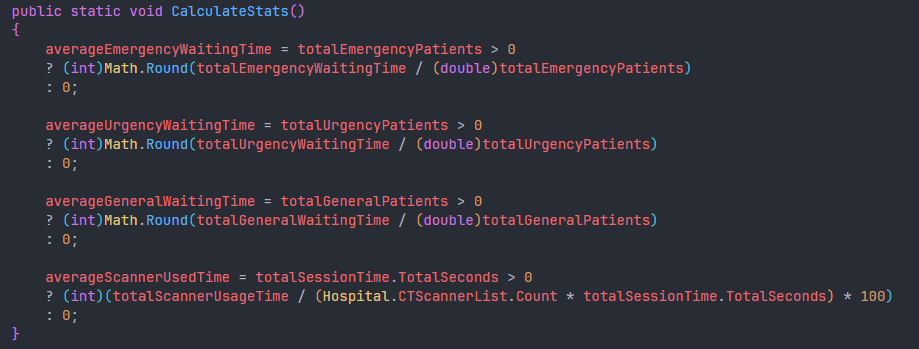

# EJERCICIO 2 - TAREA 5

 

### Descripción

Para esta tarea, se buscan los siguientes objetivos:

- Al final de la simulación mostraremos unas estadísticas:
  - Número total de pacientes atendidos por prioridad.
  - Tiempo promedio de espera por paciente.
  - Uso promedio de las máquinas de diagnóstico.

 

### Pruebas

 

 

### Pregunta 1

`¿Puedes explicar tu código y porque has decidido hacerlo así? `

> **Respuesta según el código**:
> 
> He decidido crear otro hilo separado que se encargase de ir recopilando y sumando los pacientes según prioridad sobre la marcha. Podría haber implementado la recopilación de forma secuencial en el mismo código del método principal HospitalPriorityProgram(), pero me parecía ensuciar demasiado el código, así
> podemos tener un hilo consumidor que va almacenando esas estadísticas durante todo el programa y la calcula una vez termina el resto de hilos.
> 
> También me sirve para seguir practicando todo este tema de los Threads.
> 
> En este, se va comprobando según se van añadiendo pacientes y al final del programa, mediante un método explícito, se calculan todas las estadísticas. Todo desde la clase Statistics.
>
> En el programa principal, en el método ConsultationSelectionProcess(), justo cuando el paciente entra en proceso a través del método PriorityPatientProcess(), ahí es donde se encola el paciente a la lista de statsPatientList<> ya que, lógicamente sabemos que ha terminado su espera.
>
> Para el uso de los scanners, he implementado este método en la clase de Statistics:

 

### Prueba

 

> Para su uso, te lo explico a través del método donde lo uso, el de DiagnosticProcess():

 

### Prueba

 

> Y finalmente, cuando acaban todos los hilos (fin de programa), se calculan las estadísticas:

 

### Prueba

