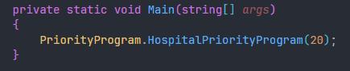
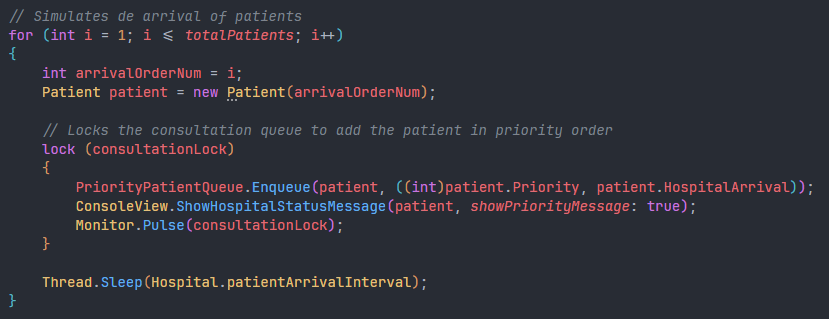
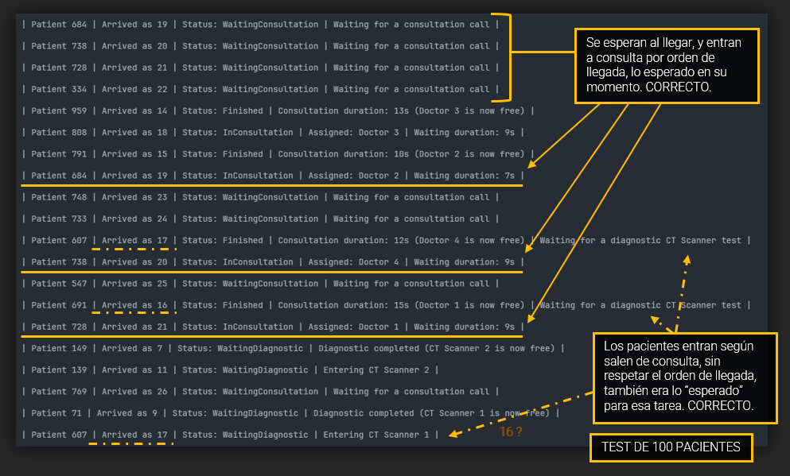
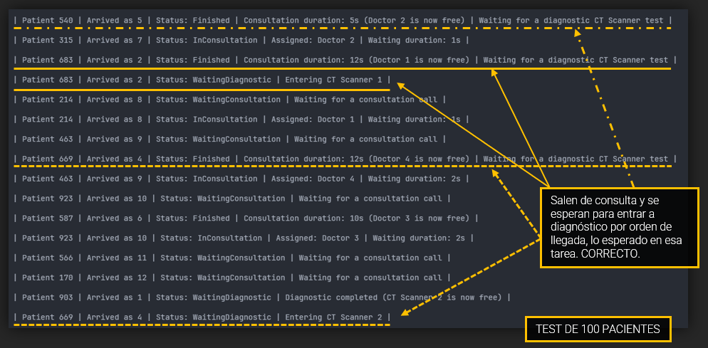

# EJERCICIO 3 - TAREA 1

 

### Descripción

Para esta tarea, se buscan los siguientes objetivos:

- Crearemos un generador de pacientes.
- Generará un nuevo paciente con datos diferentes
- Una vez creado el generador se comprobarán si las anteriores tareas funcionan correctamente.

 

> [!NOTE]
> Para este ejercicio, se sigue reaprovechando el código de las tareas anteriores. El generador de pacientes es el Productor que hemos estado usando en gran parte de la práctica.
> 
> En cada Program.cs de estas tareas se llama a su método principal y se le indica por parámetro la cantidad de pacientes deseada para cada simulación.
> 
> Aun así, dejaré comentado por bloques separados el código de cada Tarea solicitada.

 

### Código principal

> Mediante la llamada desde el código principal de la Tarea 5, por ejemplo, se puede observar cómo se le introduce por parámetro la cantidad de pacientes que se desean procesar o simular.
> 
> Dentro de ese método, podemos encontrar el siguiente for, que itera generando dichos pacientes:

 

### Prueba

 

 

### Pregunta 1

`Tarea 1, ¿cumple requisitos?`

 

 

### Pregunta 2

`Tarea 2, ¿qué comportamientos no previstos detectas?`

 

 

### Pregunta 3

`Tarea 3, ¿Cómo adaptarías tu solución? (no se piden pruebas pero me explico)`

> **Respuesta según el código**:
> 
> Para esta tarea, también me funciona todo correctamente. Se consigue el objetivo igual que en el resto, sea cual sea la cantidad de pacientes. Cabe reiterar que, a partir de esta tarea, la cosa se complicó bastante. Implementar el sistema de Ticket Lock fue una tarea sencilla, no fue demasiado elaborado.
> Tenía un flujo/código bastante gráfico y fácil de entender, llegas, coges ticket, y esperas tu turno.
> 
> Pero para la siguiente tarea (#4) la cosa se me complicó bastante, ya que con el sistema de tickets se me complicaba bastante el código. Debía crear 3 listas e implementar una máquina de tickets para cada lista. Me parecía ya algo más.. ¿redundante? Y aquí es donde entró en juego la PriorityQueue.
> 
> Básicamente está declara y definida para esta tarea, es perfecta. Pero con ello conlleva una serie de implementaciones extra. Ahora ya el sistema de tickets se complica, porque para una priority queue ¿cómo vas a meter por ticket a pacientes que podrían salir antes aún llegando más tarde? debido a la
> prioridad claro..
> 
> Así que aquí me quedó claro que los pacientes no podían ser hilos.. además, 20 hilos ya choca un poco ¿no? Así que, como digo, aquí mi cerebro entendió que se trata de un productor/consumidor como una casa. Claro, al principio eran solo 4 pacientes, aún tenía algo de sentido. Pero sin duda, para pacientes
> “infinitos” productor/consumidor es perfecto.
> 
> A pesar del desafío de la práctica y los “dolores de cabeza” que me ha dado, he quedado muy satisfecho con el resultado. Me gusta la concurrencia, la programación cobra mucho más sentido.

 

# THE END :D.

