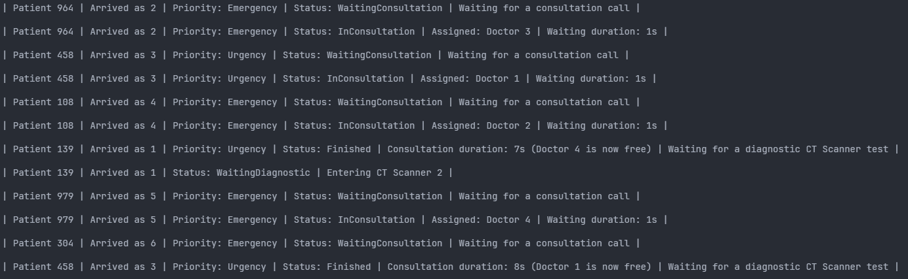

  
  # SIMULACIÓN DE URGENCIAS EN UN HOSPITAL
  

 

La simulación representa un entorno real de urgencias de un hospital. Para la llegada de los pacientes se ha establecido un intervalo de 2 segundos y tras su entrada, se le asigna un número de llegada. Realiza una "llamada" para ser atendido y si hay doctores disponibles irán metiendo a los pacientes por orden de llegada/prioridad (dependiendo del nivel de evolución del proyecto).
  
En consulta, los pacientes permanecen durante un periodo de tiempo aleatorio, si el doctor lo cree conveniente (al azar también) se le asignará el estado de "requiere diagnóstico". Si el paciente requiere de diagnóstico, saldrá de la consulta y esperará hasta tener una máquina de diagnósitco libre. Cuando una de estas máquinas esté libre, el paciente que esperaba un diagnóstico entrará y se le realizará las pruebas pertinentes.
  
Finalmente, cuando todos los pacientes sean procesados, en el último punto de la evolución del proyecto, se mostrarán unas estadísticas de la simulación realizada en ese momento.

 

 

## Índice

- [Características](#características)
- [Arquitectura del Sistema](#arquitectura-del-sistema)
- [Tecnología Utilizadas](#tecnologías-utilizadas)
- [Estructura del Proyecto](#estructura-del-proyecto)

 

## Características

- **Simulación de Pacientes:** Los pacientes se crean y se asignan a diferentes niveles de prioridad.
- **Uso de Hilos:** Se utilizan hilos para gestionar las tareas de consulta y diagnóstico en paralelo (según evolución del proyecto).
- **Escáneres de Diagnóstico:** Los pacientes son atendidos por escáneres, simulando tiempos de espera y diagnóstico.
- **Gestión de Prioridades:** Los pacientes son atendidos primero por su nivel de urgencia, y en caso de empate, se respeta el orden de llegada (según evolución del proyecto).
- **Sistema de Tickets** Los pacientes obtienen un "ticket" de atención basado en el orden de llegada al hospital y prioridad (según evolución del proyecto).

 

## Arquitectura del Sistema

La arquitectura del sistema se basa en varios compoenentes clave:

1. **Paciente:** Cada paciente tiene su ID, número de llegada, prioridad (según ebvolución del proyecto), estado y tiempo de espera.
2. **Consulta Médica:** Representa el proceso de revisión médica que cada paciente de pasar durante un tiempo aleatorio de entre 5 y 15 segundos.
3. **Escáner de diagnóstico:** El sistema permite que los pacientes sean diagnosticados mediante escáneres. Su uso es concurrente, al igual que las consultas.
4. **Estadística de la simulación:** Al final de cada simulación se generan las estadísticas correspondientes. Cantidad de pacientes por prioridad, su tiempo medio de espera y la media de uso de los escáneres en porcentaje.

 

## Tecnologías Utilizadas

- **Lenguaje:** C#
- **Hilos y Concurrencias:** Uso de `Thread`.
- **Estructuras de Datos Concurrentes:**  `ConcurrentQueue`, `BlockingCollection` y `PriorityQueue`.
- **Control de Flujo:** `SemaphoreSlim`, `object locker` y `Monitor`.

 

## Estructura del Proyecto

El proyecto está organizado en varios archivos que representan diferentes aspectos del sistema:

### Hospital

#### Services
- **`Hospital.cs`:** Contiene la lógica común del hospital utilizada por los dos principales y diferentes procesos (según evolución del proyecto).
- **`TicketProgram.cs`:** Representa el proceso de atención a pacientes mediante el método de tickets (como una pescadería).
- **`PriorityProgram.cs`:** A diferencia del de tickets, gestiona la atención de los pacientes mediante prioridad (Emergencias, Urgencias y General).
- **`Statistics.cs`:** Lógica encargada de calcular las estadísticas de cada simulación.

### Models
- **`Patient.cs`:** Representa el paciente con todas la información requerida.
- **`Doctor.cs`:** Contiene la estructura de los médicos, también con su información básica.
- **`CTScanner.cs`:** Esctructura de cada escáner.

### Helpers
- **`RandomIdGenerator.cs`:** Contiene la lógica para generar IDs aleatorios en un rango específico.
- **`TurnTicket.cs`:** Define la lófica de las máquinas de tickets. Recoge ticket, espera turno y avanza al siguiente.
- **`ConsoleView.cs`:** Encargado de mostrar los estados de cada paciente por consola en tiempo real.

### Ejercicio X

Dentro de cada carpeta Ejercicio X, hay otras subcarpetas Tarea X y dentro de las mismas tendremos el archivo `Program.cs` encargado de ejectuar los métodos del proceso de cada paciente. Desde el primer ejercicio hasta la Tarea 2 del Ejercicio 2, la lógica principal estará dentro de este archivo `Program.cs`, pero a partir de la Tarea 2 del Ejercicio 2, la lógica ha sido encapsulada y reutilizada para el resto de Tareas.

 

<table align="center" border="6px">
  <tr>
    <td>
      <pre>
        HOSPITAL-URGENCIAS
        │
        ├── 📝 Ejercicio1
        │   ├── 🗂️ Tarea1
        │   │   ├── 📄 Program.cs
        │   │   ├── 📚 README.md
        │   │   └── 📁 Tarea1.csproj
        │   ├── 🗂️ Tarea2
        │   ├── 🗂️ Tarea3
        │
        ├── 📝 Ejercicio2
        │
        ├── 📝 Ejercicio3
        │
        ├── 🏥 Hospital
        │   ├── 🛠️ Helpers
        │   │   ├── 💻 ConsoleView.cs
        │   │   ├── 🔑 RandomIdGenerator.cs
        │   │   └── 📝 TurnTicket.cs
        │   ├── 🧑‍⚕️ Models
        │   │   ├── 🚑 CTSscanner.cs
        │   │   ├── 👨‍⚕️ Doctor.cs
        │   │   └── 🏥 Patient.cs
        │   ├── ⚙️ Services
        │   │   ├── 📊 PriorityProgram.cs
        │   │   ├── 📈 Statistics.cs
        │   │   ├── 🏷️ TicketProgram.cs
        │   │   └── 🏥 Hospital.cs
      </pre>
    </td>
  </tr>
</table>

###### © Sammy

